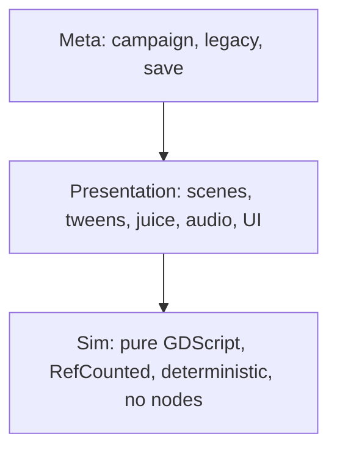

# Tactics RPG: build plan

| Prop    | Value |
|---------|-------|
| Status  | MVP loop built 2026-09-28 and the rough edges worked: competent policy, Tongue in play, scar marks, tile variants, forgery, emeriti, mercenaries, five ambitions. Awaiting Jason's play |
| Updated | 2026-09-26 |
| Engine  | Godot 4.7.1 (installed at /Applications/Godot.app) |
| Art     | Aseprite 1.3.18 CLI (installed) |

## What we are transposing from the Astra post

The post's fidelity came from four habits, none of them engine-specific:

1. **Experience-first brief.** One thing that must feel right, with visual references, before any architecture.
2. **The agent can see and measure.** A debug interface exposing game state, named test scenes that jump straight to a situation, automated screenshots and assertions, performance counters.
3. **Human judges feel, agent does everything else.** Play, give one specific observation, agent fixes and re-measures.
4. **Tests cover the journey, not just units.** Landing sequences, transitions, save/reload consistency.

Godot equivalents:

| Astra post | This project |
|---|---|
| `window.__VOID_EXPLORER__` state API | `DebugApi` autoload: JSON dump of sim state on demand, CLI flag `--debug-dump` |
| Named test scenes | `--scene=<name>` launcher arg jumping to a preset battle, event or legacy screen |
| Playwright screenshots | `--write-movie` PNG sequence for juice review; `Image.save_png` from a `Screenshot` autoload; Claude reads the PNGs |
| Vitest | GUT 9.7.1, run headless with exit code: `godot --headless -s addons/gut/gut_cmdln.gd --path . -gdir=res://tests -gexit` |
| Performance counters | `Performance.get_monitor` sampled into the debug dump |
| Blender model | Layered `.aseprite` source files exported by CLI script to sheets plus JSON |

## Architecture

Three layers, dependencies flow downward only.

- **Sim** is testable headless with no rendering. Seeded RNG. Every action is a command, every outcome an event list. Replays and AI search fall out of this for free.
- **Presentation** consumes event lists and plays them with tweens. Nothing in here decides rules.
- **Meta** owns the campaign graph, roster, legacy hall and saves. Content is data: `.tres` Resources for units, abilities, traits, events and transformations.

Language: GDScript throughout. Reason: fastest edit-run loop for an agent, no build step, GUT and headless tooling are first class.

## Core design pillars

1. **Turn-based tactics** on a square grid, orthographic top-down 3/4 view. Small squads (3 to 5), short fights (under 10 minutes), positioning and ability synergy over stat inflation.
2. **Character evolution.** Traits from events, transformations that replace body parts on the sprite (paper-doll layers make this visible), ageing across chapters, relationships that unlock combo abilities.
3. **Roguelike structure.** Procedural campaign map of nodes (fight, event, rest, boss). Permadeath. Seeded runs. Run modifiers.
4. **Legacy (Wildermyth-inspired).** Heroes who survive a campaign enter the Hall. They return in later campaigns at a legacy tier with retained traits and a chance of their old gear. Dead heroes leave heirlooms and story hooks. Unlocks (traits, events, classes) persist across everything.
5. **Incentives.** Continue: threat escalates per chapter, heroes age out, arcs resolve, chapter-end choices reshape the map. Start new: Hall roster with visible tiers, campaign modifiers and seeds, unlock tree with a visible "next unlock", a short campaign length (3 chapters, roughly 3 hours) so a fresh start is never a chore.

## Decisions taken (2026-09-26)

| Topic | Decision |
|---|---|
| Location | This folder, `git init` |
| View | Top-down 3/4, square grid |
| Language | GDScript |
| Tooling | Godot CLI, GUT, Aseprite CLI. Claude installs and runs everything; Jason's role is ideas, design and judging feel |
| Art source | AI-generated, local models only, £0 spend. No subscriptions, no API credits |
| Art bar | Into the Breach acceptable, Fire Emblem GBA ideal |
| Animation | Minimal for MVP: one ready pose, one hit pose, one attack pose per unit |
| MVP placeholders | Portraits, backgrounds and icons may be placeholders until after phase 2 |
| Setting | China Miéville x Bronze Age Collapse |

## Design pillars

Character evolution, legacy, incentives and the setting brief are agreed and written up in `docs/design.md`. Working title: Bronze Remembers.

## Art pipeline

- Source of truth: layered `.aseprite` files (body, head, armour, weapon, transformation overlays), one shared palette.
- Sprite size 32x32 for units, 16x16 tiles.
- `scripts/art/export.sh` runs `aseprite -b` per file: `--sheet`, `--data`, `--split-layers` where needed, then a Godot import script builds `SpriteFrames`.
- Generation is local on the M5 Air (16 GB), verified 2026-09-26 (evidence in `docs/art-smoke/`):

| Role | Runtime and model | Licence | Measured on this Air |
|---|---|---|---|
| Characters | mflux + FLUX.2 klein base 4B 4-bit (`AITRADER/FLUX2-klein-base-4B-mlx-4bit`) + `svntax-dev/pixel_spritesheet_4walk_small_lora_v1` | Apache 2.0 base and LoRA, CC BY 4.0 dataset | 512px, 50 steps: 3 min 4 s per 16-frame sheet (4 facings, cast, jump, fallen) |
| Tiles, props, icons, portraits | mflux + Z-Image Turbo 4-bit (`filipstrand/Z-Image-Turbo-mflux-4bit`) | Apache 2.0 | 512px, 9 steps: 24 s |
| Grid recovery and colour | `unfake` (`-s 4` for sheets, `-c 16`, `--transparent-background`), then a per-unit colour map from identifier colours to the palette | MIT | 52 ms |
| Frames, outline, sheet packing | Aseprite 1.3.18 CLI + Lua (`anim.lua`: idle bob, attack squash and lunge, hit flash) | already installed | verified |
| Godot import | `build_spriteframes.gd` run headless: sheet JSON to `SpriteFrames` `.tres` with `AtlasTexture` per frame | project code | verified |

- Rules learned: prompt for a flat magenta or white background and a 2px margin; always pass `-s` to unfake; pass mflux the LoRA's snapshot symlink path (it needs the `.safetensors` extension, and the resolved blob has none); feed Aseprite RGBA PNGs; put a transparent entry in any ImageMagick remap palette; never use rembg's default model (CC BY-NC). Chroma key beats background removal models here.
- Colour: the LoRA mutes colour, so prompts name an identifier primary per region and a per-unit colour map swaps them to the palette. Bodies are generated with empty hands; weapons and shields are class overlays drawn once per facing.
- Consistency across a hero's evolution: lock seed and prompt skeleton, vary only the bracketed descriptors; for a promoted class or a graft, use klein edit mode with the approved sheet as reference. Paper-doll overlays (grafts, scars, gear) are drawn once per overlay and composited in Aseprite Lua.
- Claude writes Aseprite Lua for recolours, overlays and animation frames. Code-drawn sprites from primitives are the fallback for tiles and props only; every write-up found says LLM-drawn characters are weak.
- Runtime fallbacks if mflux disappoints on speed: `draw-things-cli` (Homebrew, GPLv3, curated 6-bit models), then ComfyUI on MPS (2 to 7x slower).

## Phases

Agreed 2026-09-27. MVP is the full legacy loop, built for Jason to decide whether to continue: placeholders allowed, no tutorial, debug menu visible. Estimates are agent execution time with Jason reviewing at checkpoints.

| # | Phase | Ships | Estimate |
|---|---|---|---|
| 0 | Foundations (done 2026-09-27) | Git repo, project.godot with pixel settings, CLAUDE.md, GUT 9.7.1 on `make test`, DebugApi and Screenshot autoloads, `--scene` launcher, `scripts/art/export.zsh` (generate, grid-recover, theme colour map, review), theme families bronze, tide and ash in `.claude/themes/` with sprite ramps and skin in `art/palettes/` (hearth and reed follow with the map) | 1 day |
| 1 | Vertical slice (accepted 2026-09-27) | One battle: three levy heroes, three base classes, two enemy families each with its own deck so the deck system shows, a reinforcement wave, deterministic combat, individual initiative with revealed cards, cooldowns, three conditions, downed bodies, kill and hold objectives. Proves one thing: a hit feels right and a fight is a puzzle | 1 to 2 weeks |
| 2 | First run (built 2026-09-27) | Three chapters on a generated map with battle, friendly city, scribal, rest and Temple nodes. Palace writ (conscription, reports) and Scribes testimony (deed queue, scribal range). One graft source (Smiths' bronze from severe injury) with the paper-doll layer. Two enemy families, one grafted variant. Tracks frozen at Whole. One ambition. Save and load | 2 to 3 weeks |
| 3 | First Register (built 2026-09-28) | Tiers and bands, age, retirement to the Road and one civic seat pool, descendants and inheritance, tier budget at squad creation, the fall by generations elapsed as a stand-in | 2 weeks |
| 4 | Full loop (MVP, built 2026-09-28) | All four institutions with branching arcs, five tracks with stages and curves, sorcery, bronze memory, seats with recipes and succession, the Chronicle, the fall by three tracks Gone | 4 to 6 weeks |
| 5 | Beyond MVP | Tutorial, audio pass, UI pass, accessibility, performance budget, itch build | after the decision |

Phase 1 is the Astra "start with one thing you want to feel right" step. Nothing in phases 2 to 4 starts until the hit lands for Jason.

## Definition of done per phase

- GUT suite green headless.
- One journey test per phase (a scripted playthrough of the new loop through the sim layer).
- A recorded PNG sequence of the new feature reviewed by Jason.
- CHANGELOG entry.

## Open questions

None blocking. Resolved decisions live in the table above and in `docs/design.md`. Phase 0 starts on Jason's go.
