# Bronze Remembers Beyond MVP Roadmap

The MVP loop is built and awaits play. This phase maps how the seven systems act on each other, builds what that map asks for, tunes it and then makes the game shippable. Core is committed; Secondary tunes what Core built and waits on every Core milestone; Tertiary waits on every Secondary one.

**Critical path:** `1DS.1` → the 21 pair spikes (the six Field pairs also wait on `G1` → `1TR.1`) → `1DS.23` → `7SY.1`; every build task hangs off the spikes for the pairs it touches, and Interplay's consolidation grows the roadmap.

---

## Milestone 1: Interplay

**Goal:** Every pair of the seven systems has a written answer to how each changes the other, and the roadmap has grown from those answers.

- [ ] **1DS.1**: Create docs/interplay.md: a 7×7 matrix of the systems (Field, Road, Body, Register, Institutions, Collapse, Chronicle) with a section template per pair
- [ ] **1DS.2**: Spike Road × Body: how each changes the other; write its design.md section and matrix cell, then propose build tasks _(blocked: depends on 1DS.1)_
- [ ] **1DS.3**: Spike Road × Register: how each changes the other; write its design.md section and matrix cell, then propose build tasks _(blocked: depends on 1DS.1)_
- [ ] **1DS.4**: Spike Road × Institutions: how each changes the other; write its design.md section and matrix cell, then propose build tasks _(blocked: depends on 1DS.1)_
- [ ] **1DS.5**: Spike Road × Collapse: how each changes the other; write its design.md section and matrix cell, then propose build tasks _(blocked: depends on 1DS.1)_
- [ ] **1DS.6**: Spike Road × Chronicle: how each changes the other; write its design.md section and matrix cell, then propose build tasks _(blocked: depends on 1DS.1)_
- [ ] **1DS.7**: Spike Body × Register: how each changes the other; write its design.md section and matrix cell, then propose build tasks _(blocked: depends on 1DS.1)_
- [ ] **1DS.8**: Spike Body × Institutions: how each changes the other; write its design.md section and matrix cell, then propose build tasks _(blocked: depends on 1DS.1)_
- [ ] **1DS.9**: Spike Body × Collapse: how each changes the other; write its design.md section and matrix cell, then propose build tasks _(blocked: depends on 1DS.1)_
- [ ] **1DS.10**: Spike Body × Chronicle: how each changes the other; write its design.md section and matrix cell, then propose build tasks _(blocked: depends on 1DS.1)_
- [ ] **1DS.11**: Spike Register × Institutions: how each changes the other; write its design.md section and matrix cell, then propose build tasks _(blocked: depends on 1DS.1)_
- [ ] **1DS.12**: Spike Register × Collapse: how each changes the other; write its design.md section and matrix cell, then propose build tasks _(blocked: depends on 1DS.1)_
- [ ] **1DS.13**: Spike Register × Chronicle: how each changes the other; write its design.md section and matrix cell, then propose build tasks _(blocked: depends on 1DS.1)_
- [ ] **1DS.14**: Spike Institutions × Collapse: how each changes the other; write its design.md section and matrix cell, then propose build tasks _(blocked: depends on 1DS.1)_
- [ ] **1DS.15**: Spike Institutions × Chronicle: how each changes the other; write its design.md section and matrix cell, then propose build tasks _(blocked: depends on 1DS.1)_
- [ ] **1DS.16**: Spike Collapse × Chronicle, including name drift with Tongue (Q40): how each changes the other; write its design.md section and matrix cell, then propose build tasks _(blocked: depends on 1DS.1)_
- [ ] **1DS.17**: Spike Field × Road: how each changes the other; write its design.md section and matrix cell, then propose build tasks _(blocked: depends on 1DS.1, 1TR.1)_
- [ ] **1DS.18**: Spike Field × Body: how each changes the other; write its design.md section and matrix cell, then propose build tasks _(blocked: depends on 1DS.1, 1TR.1)_
- [ ] **1DS.19**: Spike Field × Register: how each changes the other; write its design.md section and matrix cell, then propose build tasks _(blocked: depends on 1DS.1, 1TR.1)_
- [ ] **1DS.20**: Spike Field × Institutions: how each changes the other; write its design.md section and matrix cell, then propose build tasks _(blocked: depends on 1DS.1, 1TR.1)_
- [ ] **1DS.21**: Spike Field × Collapse: how each changes the other; write its design.md section and matrix cell, then propose build tasks _(blocked: depends on 1DS.1, 1TR.1)_
- [ ] **1DS.22**: Spike Field × Chronicle: how each changes the other; write its design.md section and matrix cell, then propose build tasks _(blocked: depends on 1DS.1, 1TR.1)_
- [ ] **1DS.23**: Consolidate the interplay matrix: reconcile conflicts between pairs and hand the proposed build tasks to the roadmap _(blocked: depends on 1DS.2, 1DS.3, 1DS.4, 1DS.5, 1DS.6, 1DS.7, 1DS.8, 1DS.9, 1DS.10, 1DS.11, 1DS.12, 1DS.13, 1DS.14, 1DS.15, 1DS.16, 1DS.17, 1DS.18, 1DS.19, 1DS.20, 1DS.21, 1DS.22)_
- [ ] **1TR.1**: Triage G1 playthrough notes into tasks _(blocked: depends on G1)_

---

## Milestone 2: The Field

**Goal:** Combat mechanics answer to every other system, and every unit and tile they introduce reads at 32×32.

- [ ] **2CT.1**: Class list and multiclass prerequisites (Q6, Field half) _(blocked: depends on 1DS.18, 1DS.19)_
- [ ] **2CT.2**: Tier-1 promotion forms: 12 forms, one ability and one silhouette each (Q38) _(blocked: depends on 2CT.1)_
- [ ] **2CT.3**: Enemy family list, profiles and grafted variant decks per chapter (Q29) _(blocked: depends on 1DS.20, 1DS.21)_
- [ ] **2CT.4**: Named unit type pools per family, minimum set (Q39) _(blocked: depends on 2CT.3, 1DS.22)_
- [ ] **2SY.1**: Speed formula shape: which of class, graft, scar, age, ink and armour modify it (Q27 rule) _(blocked: depends on 1DS.18)_
- [ ] **2SY.2**: Deployment zone and reinforcement wave rules per objective (Q33 rule) _(blocked: depends on 1DS.17)_
- [ ] **2AR.1**: Legibility: ink lines, scars and heraldry at 32×32 across four facings (Q51) _(blocked: depends on 1DS.18)_
- [ ] **2AR.2**: Sprites for the 12 tier-1 promotion forms _(blocked: depends on 2CT.2, 2AR.1)_
- [ ] **2AR.3**: Sprites for new enemy families and named units _(blocked: depends on 2CT.4, 2AR.1)_
- [ ] **2AR.4**: Tile list with per-stage variants (Q49) _(blocked: depends on 1DS.17, 1DS.21)_
- [ ] **2AR.5**: Tile art for the tile list _(blocked: depends on 2AR.4)_

---

## Milestone 3: The Road

**Goal:** The map, its seasons and ships, and the events on it carry what every other system does to a journey.

- [ ] **3CT.1**: Twelve starting capitals: terrain bands, harbours and landmarks (Q42) _(blocked: depends on 1DS.3, 1DS.5)_
- [ ] **3SY.1**: Season model: which roads close when, and how seasons map to days and chapters (Q43) _(blocked: depends on 1DS.5, 1DS.17)_
- [ ] **3SY.2**: Ship rules: days saved, exposure per crossing, the tide-caller's attention (Q44) _(blocked: depends on 1DS.2, 1DS.5)_
- [ ] **3SY.3**: Day-cost rules: what costs days and what falls due (Q46 rule) _(blocked: depends on 3SY.1)_
- [ ] **3CT.2**: Ambition milestone tables per chapter (Q45) _(blocked: depends on 3CT.1)_
- [ ] **3SY.4**: Event placement: road versus node (Q47) _(blocked: depends on 1DS.2, 1DS.4, 1DS.6)_
- [ ] **3CT.3**: Event deck to a healthy size, carrying fixation, grudge and emeritus hooks (Q47, Q9) _(blocked: depends on 3SY.4, 4CT.4, 4SY.2)_
  - Note: Exempt from the minimum-content rule: events carry most of the narrative-into-mechanics load.
- [ ] **3CT.4**: Ward event (Q1, event half) _(blocked: depends on 3SY.4, 1DS.3)_
- [ ] **3AR.1**: Map, node and edge art _(blocked: depends on 3CT.1)_

---

## Milestone 4: The Body Remembers

**Goal:** What happens to a hero's body and heart changes how they fight, travel and are remembered.

- [ ] **4CT.1**: Trait pools per origin and the non-injury trait list, minimum set (Q5) _(blocked: depends on 1DS.2, 1DS.7)_
- [ ] **4CT.2**: Sea joints and Temple marks grafts (Q7) _(blocked: depends on 1DS.8, 1DS.9)_
- [ ] **4CT.3**: Quirks list (Q8) _(blocked: depends on 1DS.18)_
- [ ] **4CT.4**: Fixation list, grown alongside the event deck (Q9) _(blocked: depends on 1DS.10)_
- [ ] **4SY.1**: Bond types: how they form and what each unlocks (Q10) _(blocked: depends on 1DS.7, 1DS.18)_
- [ ] **4SY.2**: Grudges: what a grudge does when its scene arrives (Q11) _(blocked: depends on 1DS.10, 1DS.18)_
- [ ] **4AR.1**: Overlay layers for new grafts and quirks _(blocked: depends on 4CT.2, 4CT.3, 2AR.1)_

---

## Milestone 5: The Register

**Goal:** Every life that ends on the Register, by retirement, death or inheritance, leaves a mark the next campaign can feel.

- [ ] **5CT.1**: Seat recipes, minimum set (Q4) _(blocked: depends on 1DS.3, 1DS.7, 1DS.11, 1DS.13)_
- [ ] **5SY.1**: Descendants contesting inheritance at Custom Gone (Q17) _(blocked: depends on 1DS.12)_
- [ ] **5CT.2**: Emeritus chain variants per route, minimum set (Q19) _(blocked: depends on 1DS.3)_
- [ ] **5SY.2**: Retirement scene: how the seat choice is presented (Q20) _(blocked: depends on 8SY.2)_
- [ ] **5SY.3**: Ward lineage: caregivers from bonds, tier 0 with a grudge when none qualify (Q1, lineage half) _(blocked: depends on 3CT.4, 4SY.1, 4SY.2)_
- [ ] **5SY.4**: Register unlock tree (Q6, Register half) _(blocked: depends on 2CT.1)_

---

## Milestone 6: The Institutions

**Goal:** Each institution's arc moves with the player's choices and reaches its end states through authored transitions.

- [ ] **6CT.1**: Author arc transitions to the section 17 end states (Q3) _(blocked: depends on 1DS.4, 1DS.8, 1DS.11, 1DS.14, 1DS.15, 1DS.20)_
- [ ] **6SY.1**: Substitution failure at Broken Rite (Q16) _(blocked: depends on 1DS.14)_

---

## Milestone 7: The Collapse

**Goal:** The five tracks reach into every other system.

- [ ] **7SY.1**: Placeholder: Collapse build tasks proposed by Interplay _(blocked: depends on 1DS.23)_

---

## Milestone 8: The Chronicle

**Goal:** The game tells its story in the Scribes' voice and the heroes' own, and what it says feeds back into play.

- [ ] **8CT.1**: Chronicle templates per deed and seat type (Q12) _(blocked: depends on 1DS.6, 1DS.10, 1DS.13, 1DS.15)_
- [ ] **8SY.1**: Testimony reach: what significance means and how far a deed travels to a scribe (Q14) _(blocked: depends on 1DS.6, 1DS.15)_
- [ ] **8SY.2**: Hero voice: how a hero speaks by origin, bonds and scars, heard first at retirement _(blocked: depends on 1DS.10, 1DS.13)_
- [ ] **8SY.3**: Rumours at nodes: what travels, how true it is and what it changes _(blocked: depends on 8SY.1)_
- [ ] **8SY.4**: Name generator: Hittite and Ugaritic phonetics, per-city variation, drift with Tongue (Q40) _(blocked: depends on 1DS.16, 3CT.1)_

---

## Milestone 9: The Field (Secondary)

**Goal:** Combat numbers are tuned in play and a hit lands with weight.

- [ ] **9TN.1**: Speed values (Q27) _(blocked: depends on M2, M3, M4, M5, M6, M7, M8)_
- [ ] **9TN.2**: Cooldowns per ability and the basic attack's damage scale (Q28) _(blocked: depends on M2, M3, M4, M5, M6, M7, M8)_
- [ ] **9TN.3**: Condition durations and treatments: Wound, Bound, Dread (Q30) _(blocked: depends on M2, M3, M4, M5, M6, M7, M8)_
- [ ] **9TN.4**: Downing draw weights: scar, severe, death against overkill and enemy strength (Q31) _(blocked: depends on M2, M3, M4, M5, M6, M7, M8)_
- [ ] **9TN.5**: Deployment zone sizes and reinforcement wave counts (Q33) _(blocked: depends on M2, M3, M4, M5, M6, M7, M8)_
- [ ] **9TN.6**: Movement cost of a downed body's tile (Q35) _(blocked: depends on M2, M3, M4, M5, M6, M7, M8)_
- [ ] **9TN.7**: Terrain exposure counts per graft (Q37) _(blocked: depends on M2, M3, M4, M5, M6, M7, M8)_
- [ ] **9TN.8**: Hit feel: weight, juice and timing _(blocked: depends on M2, M3, M4, M5, M6, M7, M8)_
- [ ] **9CT.1**: Tier-2 promotion forms: 24 forms (Q38) _(blocked: depends on M2, M3, M4, M5, M6, M7, M8)_
- [ ] **9CT.2**: Named unit pools to target size (Q39) _(blocked: depends on M2, M3, M4, M5, M6, M7, M8)_
- [ ] **9AR.1**: Sprites for the 24 tier-2 promotion forms _(blocked: depends on 9CT.1)_
- [ ] **9AR.2**: Extra animation frames for hit feel _(blocked: depends on 9TN.8)_

---

## Milestone 10: The Road (Secondary)

**Goal:** Journey costs are tuned so the road presses without grinding.

- [ ] **10TN.1**: Road kills: nodes before an untreated severe injury is fatal, per injury type (Q32) _(blocked: depends on M2, M3, M4, M5, M6, M7, M8)_
- [ ] **10TN.2**: Day-cost values and due dates for reports, ink calls and injuries (Q46) _(blocked: depends on M2, M3, M4, M5, M6, M7, M8)_

---

## Milestone 11: The Body Remembers (Secondary)

**Goal:** Trait variety reaches its target and heroes have faces.

- [ ] **11CT.1**: Trait pools to target size (Q5) _(blocked: depends on M2, M3, M4, M5, M6, M7, M8)_
- [ ] **11AR.1**: Portrait format (Q50, portrait half) _(blocked: depends on M2, M3, M4, M5, M6, M7, M8)_

---

## Milestone 12: The Register (Secondary)

**Goal:** Seats and emeritus chains reach their target variety.

- [ ] **12CT.1**: Seat recipes to target size (Q4) _(blocked: depends on M2, M3, M4, M5, M6, M7, M8)_
- [ ] **12CT.2**: Emeritus chain variants to target size (Q19) _(blocked: depends on M2, M3, M4, M5, M6, M7, M8)_

---

## Milestone 13: The Collapse (Secondary)

**Goal:** The tracks tick at a pace that feels earned, and the world's colour shows it.

- [ ] **13TN.1**: Track tick curves (Q13) _(blocked: depends on M2, M3, M4, M5, M6, M7, M8)_
- [ ] **13AR.1**: World and Sea palettes through the theme skill, bleed by region and stage (Q48) _(blocked: depends on M2, M3, M4, M5, M6, M7, M8)_

---

## Milestone 14: The Chronicle (Secondary)

**Goal:** Deeds are weighted so testimony rewards what matters, and the UI has a style.

- [ ] **14TN.1**: Deed significance values and the scribal range each buys (Q34) _(blocked: depends on M2, M3, M4, M5, M6, M7, M8)_
- [ ] **14AR.1**: UI style (Q50, UI half) _(blocked: depends on M2, M3, M4, M5, M6, M7, M8)_

---

## Milestone 15: Shippable (Tertiary)

**Goal:** The game is ready for strangers.

- [ ] **15DS.1**: Scope spike: decide Shippable contents, starting from the phase 5 list (tutorial, audio, UI, accessibility, performance, itch build) _(blocked: depends on M9, M10, M11, M12, M13, M14)_
- [ ] **15AR.1**: Final art: portraits, icons, itch key art and a consistency pass _(blocked: depends on 15DS.1)_

---

## External Gates

- **G1**: Jason's first full MVP playthrough. The MVP loop was built 2026-09-28 and awaits play. Field pairs wait on its triage (1TR.1).

---

## Dependency Diagram

```mermaid
graph LR
	classDef todo fill:#f6f6f6,stroke:#6f6f6f,color:#6f6f6f
	classDef inProgress fill:#e8f2ff,stroke:#0071af,color:#0071af
	classDef blocked fill:#fff8f6,stroke:#e0002b,color:#e0002b,stroke-width:2px
	classDef paused fill:#fdf4ff,stroke:#b01fe3,color:#b01fe3,stroke-dasharray:4 3
	classDef deferred fill:#fff8f3,stroke:#ac5c00,color:#ac5c00,stroke-dasharray:2 4,font-style:italic
	classDef done fill:#e0ffd9,stroke:#008217,color:#008217
	classDef outOfScope fill:#f6f6f6,stroke:#717171,color:#717171,stroke-dasharray:2 2
	classDef mile fill:#e3f7ff,stroke:#007590,color:#007590,font-weight:bold
	classDef external fill:#fff9e5,stroke:#7d6f00,color:#7d6f00,stroke-dasharray:4 3,font-style:italic
	classDef tierUnderway fill:#c3cede,stroke:#2f3b4c,color:#2f3b4c
	classDef tierDeferred fill:#dccbb9,stroke:#4a3826,color:#4a3826,stroke-dasharray:6 4
	subgraph tier0["Core · underway"]
		G1["G1: Jason's first full MVP playthrough"]:::external
		1DS.1["1DS.1: Create docs/interplay.md: a 7×7 matrix o…"]
		1DS.2["1DS.2: Spike Road × Body: how each changes the…"]
		1DS.3["1DS.3: Spike Road × Register: how each changes…"]
		1DS.4["1DS.4: Spike Road × Institutions: how each chan…"]
		1DS.5["1DS.5: Spike Road × Collapse: how each changes…"]
		1DS.6["1DS.6: Spike Road × Chronicle: how each changes…"]
		1DS.7["1DS.7: Spike Body × Register: how each changes…"]
		1DS.8["1DS.8: Spike Body × Institutions: how each chan…"]
		1DS.9["1DS.9: Spike Body × Collapse: how each changes…"]
		1DS.10["1DS.10: Spike Body × Chronicle: how each change…"]
		1DS.11["1DS.11: Spike Register × Institutions: how each…"]
		1DS.12["1DS.12: Spike Register × Collapse: how each cha…"]
		1DS.13["1DS.13: Spike Register × Chronicle: how each ch…"]
		1DS.14["1DS.14: Spike Institutions × Collapse: how each…"]
		1DS.15["1DS.15: Spike Institutions × Chronicle: how eac…"]
		1DS.16["1DS.16: Spike Collapse × Chronicle, including n…"]
		1TR.1["1TR.1: Triage G1 playthrough notes into tasks"]
		1DS.17["1DS.17: Spike Field × Road: how each changes th…"]
		1DS.18["1DS.18: Spike Field × Body: how each changes th…"]
		1DS.19["1DS.19: Spike Field × Register: how each change…"]
		1DS.20["1DS.20: Spike Field × Institutions: how each ch…"]
		1DS.21["1DS.21: Spike Field × Collapse: how each change…"]
		1DS.22["1DS.22: Spike Field × Chronicle: how each chang…"]
		1DS.23["1DS.23: Consolidate the interplay matrix: recon…"]
		M1["M1: Interplay"]:::mile
		2CT.1["2CT.1: Class list and multiclass prerequisites…"]
		2CT.2["2CT.2: Tier-1 promotion forms: 12 forms, one ab…"]
		2CT.3["2CT.3: Enemy family list, profiles and grafted…"]
		2CT.4["2CT.4: Named unit type pools per family, minimu…"]
		2SY.1["2SY.1: Speed formula shape: which of class, gra…"]
		2SY.2["2SY.2: Deployment zone and reinforcement wave r…"]
		2AR.1["2AR.1: Legibility: ink lines, scars and heraldr…"]
		2AR.2["2AR.2: Sprites for the 12 tier-1 promotion forms"]
		2AR.3["2AR.3: Sprites for new enemy families and named…"]
		2AR.4["2AR.4: Tile list with per-stage variants (Q49)"]
		2AR.5["2AR.5: Tile art for the tile list"]
		M2["M2: The Field"]:::mile
		3CT.1["3CT.1: Twelve starting capitals: terrain bands,…"]
		3SY.1["3SY.1: Season model: which roads close when, an…"]
		3SY.2["3SY.2: Ship rules: days saved, exposure per cro…"]
		3SY.3["3SY.3: Day-cost rules: what costs days and what…"]
		3CT.2["3CT.2: Ambition milestone tables per chapter (Q…"]
		3SY.4["3SY.4: Event placement: road versus node (Q47)"]
		3CT.4["3CT.4: Ward event (Q1, event half)"]
		3AR.1["3AR.1: Map, node and edge art"]
		4CT.1["4CT.1: Trait pools per origin and the non-injur…"]
		4CT.2["4CT.2: Sea joints and Temple marks grafts (Q7)"]
		4CT.3["4CT.3: Quirks list (Q8)"]
		4CT.4["4CT.4: Fixation list, grown alongside the event…"]
		4SY.1["4SY.1: Bond types: how they form and what each…"]
		4SY.2["4SY.2: Grudges: what a grudge does when its sce…"]
		3CT.3["3CT.3: Event deck to a healthy size, carrying f…"]
		M3["M3: The Road"]:::mile
		4AR.1["4AR.1: Overlay layers for new grafts and quirks"]
		M4["M4: The Body Remembers"]:::mile
		5CT.1["5CT.1: Seat recipes, minimum set (Q4)"]
		5SY.1["5SY.1: Descendants contesting inheritance at Cu…"]
		5CT.2["5CT.2: Emeritus chain variants per route, minim…"]
		5SY.3["5SY.3: Ward lineage: caregivers from bonds, tie…"]
		5SY.4["5SY.4: Register unlock tree (Q6, Register half)"]
		6CT.1["6CT.1: Author arc transitions to the section 17…"]
		6SY.1["6SY.1: Substitution failure at Broken Rite (Q16)"]
		M6["M6: The Institutions"]:::mile
		7SY.1["7SY.1: Placeholder: Collapse build tasks propos…"]
		M7["M7: The Collapse"]:::mile
		8CT.1["8CT.1: Chronicle templates per deed and seat ty…"]
		8SY.1["8SY.1: Testimony reach: what significance means…"]
		8SY.2["8SY.2: Hero voice: how a hero speaks by origin,…"]
		5SY.2["5SY.2: Retirement scene: how the seat choice is…"]
		M5["M5: The Register"]:::mile
		8SY.3["8SY.3: Rumours at nodes: what travels, how true…"]
		8SY.4["8SY.4: Name generator: Hittite and Ugaritic pho…"]
		M8["M8: The Chronicle"]:::mile
	end
	subgraph tier1["Secondary · deferred"]
		9TN.1["9TN.1: Speed values (Q27)"]
		9TN.2["9TN.2: Cooldowns per ability and the basic atta…"]
		9TN.3["9TN.3: Condition durations and treatments: Woun…"]
		9TN.4["9TN.4: Downing draw weights: scar, severe, deat…"]
		9TN.5["9TN.5: Deployment zone sizes and reinforcement…"]
		9TN.6["9TN.6: Movement cost of a downed body's tile (Q…"]
		9TN.7["9TN.7: Terrain exposure counts per graft (Q37)"]
		9TN.8["9TN.8: Hit feel: weight, juice and timing"]
		9CT.1["9CT.1: Tier-2 promotion forms: 24 forms (Q38)"]
		9CT.2["9CT.2: Named unit pools to target size (Q39)"]
		9AR.1["9AR.1: Sprites for the 24 tier-2 promotion forms"]
		9AR.2["9AR.2: Extra animation frames for hit feel"]
		M9["M9: The Field (Secondary)"]:::mile
		10TN.1["10TN.1: Road kills: nodes before an untreated s…"]
		10TN.2["10TN.2: Day-cost values and due dates for repor…"]
		M10["M10: The Road (Secondary)"]:::mile
		11CT.1["11CT.1: Trait pools to target size (Q5)"]
		11AR.1["11AR.1: Portrait format (Q50, portrait half)"]
		M11["M11: The Body Remembers (Secondary)"]:::mile
		12CT.1["12CT.1: Seat recipes to target size (Q4)"]
		12CT.2["12CT.2: Emeritus chain variants to target size…"]
		M12["M12: The Register (Secondary)"]:::mile
		13TN.1["13TN.1: Track tick curves (Q13)"]
		13AR.1["13AR.1: World and Sea palettes through the them…"]
		M13["M13: The Collapse (Secondary)"]:::mile
		14TN.1["14TN.1: Deed significance values and the scriba…"]
		14AR.1["14AR.1: UI style (Q50, UI half)"]
		M14["M14: The Chronicle (Secondary)"]:::mile
	end
	subgraph tier2["Tertiary · deferred"]
		15DS.1["15DS.1: Scope spike: decide Shippable contents,…"]
		15AR.1["15AR.1: Final art: portraits, icons, itch key a…"]
		M15["M15: Shippable (Tertiary)"]:::mile
	end
	G1 --> 1TR.1
	1DS.1 --> 1DS.2
	1DS.1 --> 1DS.3
	1DS.1 --> 1DS.4
	1DS.1 --> 1DS.5
	1DS.1 --> 1DS.6
	1DS.1 --> 1DS.7
	1DS.1 --> 1DS.8
	1DS.1 --> 1DS.9
	1DS.1 --> 1DS.10
	1DS.1 --> 1DS.11
	1DS.1 --> 1DS.12
	1DS.1 --> 1DS.13
	1DS.1 --> 1DS.14
	1DS.1 --> 1DS.15
	1DS.1 --> 1DS.16
	1DS.1 --> 1DS.17
	1DS.1 --> 1DS.18
	1DS.1 --> 1DS.19
	1DS.1 --> 1DS.20
	1DS.1 --> 1DS.21
	1DS.1 --> 1DS.22
	1DS.2 --> 1DS.23
	1DS.2 --> 3SY.2
	1DS.2 --> 3SY.4
	1DS.2 --> 4CT.1
	1DS.3 --> 1DS.23
	1DS.3 --> 3CT.1
	1DS.3 --> 3CT.4
	1DS.3 --> 5CT.1
	1DS.3 --> 5CT.2
	1DS.4 --> 1DS.23
	1DS.4 --> 3SY.4
	1DS.4 --> 6CT.1
	1DS.5 --> 1DS.23
	1DS.5 --> 3CT.1
	1DS.5 --> 3SY.1
	1DS.5 --> 3SY.2
	1DS.6 --> 1DS.23
	1DS.6 --> 3SY.4
	1DS.6 --> 8CT.1
	1DS.6 --> 8SY.1
	1DS.7 --> 1DS.23
	1DS.7 --> 4CT.1
	1DS.7 --> 4SY.1
	1DS.7 --> 5CT.1
	1DS.8 --> 1DS.23
	1DS.8 --> 4CT.2
	1DS.8 --> 6CT.1
	1DS.9 --> 1DS.23
	1DS.9 --> 4CT.2
	1DS.10 --> 1DS.23
	1DS.10 --> 4CT.4
	1DS.10 --> 4SY.2
	1DS.10 --> 8CT.1
	1DS.10 --> 8SY.2
	1DS.11 --> 1DS.23
	1DS.11 --> 5CT.1
	1DS.11 --> 6CT.1
	1DS.12 --> 1DS.23
	1DS.12 --> 5SY.1
	1DS.13 --> 1DS.23
	1DS.13 --> 5CT.1
	1DS.13 --> 8CT.1
	1DS.13 --> 8SY.2
	1DS.14 --> 1DS.23
	1DS.14 --> 6CT.1
	1DS.14 --> 6SY.1
	1DS.15 --> 1DS.23
	1DS.15 --> 6CT.1
	1DS.15 --> 8CT.1
	1DS.15 --> 8SY.1
	1DS.16 --> 1DS.23
	1DS.16 --> 8SY.4
	1TR.1 --> 1DS.17
	1TR.1 --> 1DS.18
	1TR.1 --> 1DS.19
	1TR.1 --> 1DS.20
	1TR.1 --> 1DS.21
	1TR.1 --> 1DS.22
	1DS.17 --> 1DS.23
	1DS.17 --> 2SY.2
	1DS.17 --> 2AR.4
	1DS.17 --> 3SY.1
	1DS.18 --> 1DS.23
	1DS.18 --> 2CT.1
	1DS.18 --> 2SY.1
	1DS.18 --> 2AR.1
	1DS.18 --> 4CT.3
	1DS.18 --> 4SY.1
	1DS.18 --> 4SY.2
	1DS.19 --> 1DS.23
	1DS.19 --> 2CT.1
	1DS.20 --> 1DS.23
	1DS.20 --> 2CT.3
	1DS.20 --> 6CT.1
	1DS.21 --> 1DS.23
	1DS.21 --> 2CT.3
	1DS.21 --> 2AR.4
	1DS.22 --> 1DS.23
	1DS.22 --> 2CT.4
	1DS.23 --> M1
	1DS.23 --> 7SY.1
	2CT.1 --> 2CT.2
	2CT.1 --> 5SY.4
	2CT.2 --> 2AR.2
	2CT.3 --> 2CT.4
	2CT.4 --> 2AR.3
	2SY.1 --> M2
	2SY.2 --> M2
	2AR.1 --> 2AR.2
	2AR.1 --> 2AR.3
	2AR.1 --> 4AR.1
	2AR.2 --> M2
	2AR.3 --> M2
	2AR.4 --> 2AR.5
	2AR.5 --> M2
	M2 --> 9TN.1
	M2 --> 9TN.2
	M2 --> 9TN.3
	M2 --> 9TN.4
	M2 --> 9TN.5
	M2 --> 9TN.6
	M2 --> 9TN.7
	M2 --> 9TN.8
	M2 --> 9CT.1
	M2 --> 9CT.2
	M2 --> 10TN.1
	M2 --> 10TN.2
	M2 --> 11CT.1
	M2 --> 11AR.1
	M2 --> 12CT.1
	M2 --> 12CT.2
	M2 --> 13TN.1
	M2 --> 13AR.1
	M2 --> 14TN.1
	M2 --> 14AR.1
	3CT.1 --> 3CT.2
	3CT.1 --> 3AR.1
	3CT.1 --> 8SY.4
	3SY.1 --> 3SY.3
	3SY.2 --> M3
	3SY.3 --> M3
	3CT.2 --> M3
	3SY.4 --> 3CT.4
	3SY.4 --> 3CT.3
	3CT.4 --> M3
	3CT.4 --> 5SY.3
	3AR.1 --> M3
	4CT.1 --> M4
	4CT.2 --> 4AR.1
	4CT.3 --> 4AR.1
	4CT.4 --> 3CT.3
	4CT.4 --> M4
	4SY.1 --> M4
	4SY.1 --> 5SY.3
	4SY.2 --> 3CT.3
	4SY.2 --> M4
	4SY.2 --> 5SY.3
	3CT.3 --> M3
	M3 --> 9TN.1
	M3 --> 9TN.2
	M3 --> 9TN.3
	M3 --> 9TN.4
	M3 --> 9TN.5
	M3 --> 9TN.6
	M3 --> 9TN.7
	M3 --> 9TN.8
	M3 --> 9CT.1
	M3 --> 9CT.2
	M3 --> 10TN.1
	M3 --> 10TN.2
	M3 --> 11CT.1
	M3 --> 11AR.1
	M3 --> 12CT.1
	M3 --> 12CT.2
	M3 --> 13TN.1
	M3 --> 13AR.1
	M3 --> 14TN.1
	M3 --> 14AR.1
	4AR.1 --> M4
	M4 --> 9TN.1
	M4 --> 9TN.2
	M4 --> 9TN.3
	M4 --> 9TN.4
	M4 --> 9TN.5
	M4 --> 9TN.6
	M4 --> 9TN.7
	M4 --> 9TN.8
	M4 --> 9CT.1
	M4 --> 9CT.2
	M4 --> 10TN.1
	M4 --> 10TN.2
	M4 --> 11CT.1
	M4 --> 11AR.1
	M4 --> 12CT.1
	M4 --> 12CT.2
	M4 --> 13TN.1
	M4 --> 13AR.1
	M4 --> 14TN.1
	M4 --> 14AR.1
	5CT.1 --> M5
	5SY.1 --> M5
	5CT.2 --> M5
	5SY.3 --> M5
	5SY.4 --> M5
	6CT.1 --> M6
	6SY.1 --> M6
	M6 --> 9TN.1
	M6 --> 9TN.2
	M6 --> 9TN.3
	M6 --> 9TN.4
	M6 --> 9TN.5
	M6 --> 9TN.6
	M6 --> 9TN.7
	M6 --> 9TN.8
	M6 --> 9CT.1
	M6 --> 9CT.2
	M6 --> 10TN.1
	M6 --> 10TN.2
	M6 --> 11CT.1
	M6 --> 11AR.1
	M6 --> 12CT.1
	M6 --> 12CT.2
	M6 --> 13TN.1
	M6 --> 13AR.1
	M6 --> 14TN.1
	M6 --> 14AR.1
	7SY.1 --> M7
	M7 --> 9TN.1
	M7 --> 9TN.2
	M7 --> 9TN.3
	M7 --> 9TN.4
	M7 --> 9TN.5
	M7 --> 9TN.6
	M7 --> 9TN.7
	M7 --> 9TN.8
	M7 --> 9CT.1
	M7 --> 9CT.2
	M7 --> 10TN.1
	M7 --> 10TN.2
	M7 --> 11CT.1
	M7 --> 11AR.1
	M7 --> 12CT.1
	M7 --> 12CT.2
	M7 --> 13TN.1
	M7 --> 13AR.1
	M7 --> 14TN.1
	M7 --> 14AR.1
	8CT.1 --> M8
	8SY.1 --> 8SY.3
	8SY.2 --> 5SY.2
	8SY.2 --> M8
	5SY.2 --> M5
	M5 --> 9TN.1
	M5 --> 9TN.2
	M5 --> 9TN.3
	M5 --> 9TN.4
	M5 --> 9TN.5
	M5 --> 9TN.6
	M5 --> 9TN.7
	M5 --> 9TN.8
	M5 --> 9CT.1
	M5 --> 9CT.2
	M5 --> 10TN.1
	M5 --> 10TN.2
	M5 --> 11CT.1
	M5 --> 11AR.1
	M5 --> 12CT.1
	M5 --> 12CT.2
	M5 --> 13TN.1
	M5 --> 13AR.1
	M5 --> 14TN.1
	M5 --> 14AR.1
	8SY.3 --> M8
	8SY.4 --> M8
	M8 --> 9TN.1
	M8 --> 9TN.2
	M8 --> 9TN.3
	M8 --> 9TN.4
	M8 --> 9TN.5
	M8 --> 9TN.6
	M8 --> 9TN.7
	M8 --> 9TN.8
	M8 --> 9CT.1
	M8 --> 9CT.2
	M8 --> 10TN.1
	M8 --> 10TN.2
	M8 --> 11CT.1
	M8 --> 11AR.1
	M8 --> 12CT.1
	M8 --> 12CT.2
	M8 --> 13TN.1
	M8 --> 13AR.1
	M8 --> 14TN.1
	M8 --> 14AR.1
	9TN.1 --> M9
	9TN.2 --> M9
	9TN.3 --> M9
	9TN.4 --> M9
	9TN.5 --> M9
	9TN.6 --> M9
	9TN.7 --> M9
	9TN.8 --> 9AR.2
	9CT.1 --> 9AR.1
	9CT.2 --> M9
	9AR.1 --> M9
	9AR.2 --> M9
	M9 --> 15DS.1
	10TN.1 --> M10
	10TN.2 --> M10
	M10 --> 15DS.1
	11CT.1 --> M11
	11AR.1 --> M11
	M11 --> 15DS.1
	12CT.1 --> M12
	12CT.2 --> M12
	M12 --> 15DS.1
	13TN.1 --> M13
	13AR.1 --> M13
	M13 --> 15DS.1
	14TN.1 --> M14
	14AR.1 --> M14
	M14 --> 15DS.1
	15DS.1 --> 15AR.1
	15AR.1 --> M15
	class 1DS.1 todo
	class 10TN.1,10TN.2,11AR.1,11CT.1,12CT.1,12CT.2,13AR.1,13TN.1,14AR.1,14TN.1,15AR.1,15DS.1,1DS.10,1DS.11,1DS.12,1DS.13,1DS.14,1DS.15,1DS.16,1DS.17,1DS.18,1DS.19,1DS.2,1DS.20,1DS.21,1DS.22,1DS.23,1DS.3,1DS.4,1DS.5,1DS.6,1DS.7,1DS.8,1DS.9,1TR.1,2AR.1,2AR.2,2AR.3,2AR.4,2AR.5,2CT.1,2CT.2,2CT.3,2CT.4,2SY.1,2SY.2,3AR.1,3CT.1,3CT.2,3CT.3,3CT.4,3SY.1,3SY.2,3SY.3,3SY.4,4AR.1,4CT.1,4CT.2,4CT.3,4CT.4,4SY.1,4SY.2,5CT.1,5CT.2,5SY.1,5SY.2,5SY.3,5SY.4,6CT.1,6SY.1,7SY.1,8CT.1,8SY.1,8SY.2,8SY.3,8SY.4,9AR.1,9AR.2,9CT.1,9CT.2,9TN.1,9TN.2,9TN.3,9TN.4,9TN.5,9TN.6,9TN.7,9TN.8 blocked
	class tier0 tierUnderway
	class tier1,tier2 tierDeferred
```

